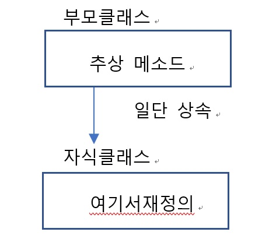
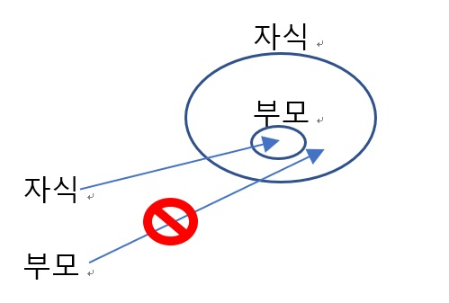

# JAVA-OOP
Power JAVA 2nd edition solutions

# 클래스와 객체 1

 **실제 세계는 객체로 이루어짐**

객체는 상태(state, 속성 ->  필드)와 동작(behavior ->  메소드)으로 이루어짐

**프로그래밍 기법의 발전**

**절차지향 프로그래밍 :** 프로시저를 중요하게 생각하는 방법. 함수들 작성, 조립

**객체지향 프로그래밍 :** 데이터와 절차를 하나의 덩어리(객체)로 묶어서 생각.

한 객체에 데이터(속성, 상태)와 함수(동작)이 묶여있음

**객체지향 프로그래밍의 특징 :** 캡슐화, 상속, 다형성 (3대 특징) , 추상화

**캡슐화 :** 관련된 데이터와 알고리즘(코드)이 하나의 묶음으로 정리되어 있는 것

**캡슐화의 목적 :** 서로 관련된 데이터와 알고리즘을 묶는다

객체를 캡슐로 싸서 객체 내부 보호 (=  정보 은닉)

**상속 :** 기존의 코드를 재활용하기 위한 기법

이미 작성된 (부모) 클래스를 이어받아 새로운 (자식) 클래스를 생성하는 기법.

**다형성(polymorphism) :** 객체가 취하는 동작이 상황에 따라서 달라지는 것을 의미

하나의 이름(방법)으로 많은 상황에 대처하는 기법
(e.g. 동일한 작업을 하는 멤버함수들에 똑같은 이름 부여)

**추상화 :** 불필요한 정보는 숨기고 중요한 정보만을 표현. (필요한 것들만 남겨두기)

**클래스(class) :** 객체를 만드는 설계도

클래스로부터 만들어지는 각각의 객체 = 인스턴스 (instance)

클래스와 객체를 헷갈리지 말자

**클래스의 구조 :** 필드(변수), 메소드(함수)

----

## 변수의 종류  
**기초변수 (primitive variable) :** 실제 데이터값이 저장

**참조변수 (reference variable) :** 객체를 참조할 때 사용되는 변수. 여기에 객체의 참조값(객체의 주소)이 저장됨

**메소드 :** 입력을 받아 처리 하고 결과 반환하는, 그냥 함수.

매개변수로 호출(값 전달) ->  인수로 받음

**메소드의 중복 정의 (메소드 오버로딩) :** 같은 이름 메소드 여러 개 가능 (but 매개변수는 달라야..)

호출할 때는 매개변수로 구분

## 생성자 (constructor)

 객체가 생성될 때 객체를 초기화하는 특수한 메소드

생성자의 이름은 클래스 이름과 같다

일반 메소드와 비슷하지만 반환값을 가지지 않는다

주로 필드에 초기값을 부여할 때 사용한다

클래스이름  인스턴스이름 = new  클래스이름(생성자  매개변수)

### 기본 생성자

매개변수가 없는 생성자

개발자가 생성자를 정의하지 않으면 자바 컴파일러는 기본생성자를 자동으로 형성

기본생성자에선 자동으로 모든 멤버변수 기본값 초기화
(정수=0 불=false 참조변수=null)

### this 참조변수

현재 객체를 가리키는 참조변수.. ”이 객체”

this는 컴파일러에서 자동으로 생성해준다

주로 생성자에서 매개변수이름과 필드 이름을 구별하기 위해 사용

#### this()

다른 생성자를 의미. 복잡한 생성자를 먼저 작성한 후에 다른 생성자가 이 생성자 호출

### 접근제어★

클래스의 멤버에 접근하는 것을 제어

**접근자와 설정자**

메소드 중, 필드와 관련된 메소드를 두 가지로 나눈다면 접근자와 생성자로 나눌 수 有

**접근자 (getters) : [get~] :** 필드값을 반환하는 메소드

**생성자 (setters) : [set~] :** 필드값을 설정하는 메소드

변수는 안에 감추고, 메소드들은 외부에서 사용하도록 허용하는 것이 좋다

# 클래스와 객체 2

**정적 멤버**  

모든 객체를 통틀어 하나만 생성, 모든 객체가 이걸 공유

모든 객체가 공유하는 하나의 멤버.. 클래스 당 하나만 생성.

**정적 변수**

모든 객체에 공통인 변수

정적 변수는 하나의 클래스에 하나만 존재

**정적 메소드**

변수와 마찬가지로 메소드도 정적 메소드로 만들 수 있음

정적 메소드는 static 수식자를 메소드 앞에 붙이며 클래스 이름을 통하여 호출되어야 함

Static 메소드는 한 클래스 내에 여러 개 존재 가능

**객체의 일생 :** 생성 사용 소멸

----
### 참조 변수의 대입

두 개의 참조변수가 하나의 객체를 가리킨다

     Pizza  obj1 = new  Pizza();
     
     Pizza  obj2;
     
     obj2 = obj1;

이 상태에서 obj2를 통하여 객체를 변경하면 obj1의 객체가 영향을 받는다

Obj2가 가리키던 객체는 아무도 가리키지 않게 된다 
->   쓰레기 수집기가 처리

자바에서는 쓰레기 수집기 (garbage collector)가 자동으로 사용이 끝난 메모리 수거

강제적으로 객체를 소멸시키려면 참조변수에 null 대입하면 된다

---
### 인수 전달 방법

**메소드로 기초형 변수가 전달되는 경우 :** 기초형 변수의 값이 복사된다

**메소드로 객체가 전달되는 경우 :** 객체를 가리키는 주소가 전달된다

**메소드로 배열이 전달되는 경우 :** 배열 또한 객체의 일종. 배열을 전달하는건

배열참조변수를 전달하는 것이다

**메소드로 기초형 변수가 전달되는 경우 :** 값이 복사된다

**메소드로 객체가 전달되는 경우 :** 객체가 복사되어 전달되는 것이 아니고

참조변수의 값이 복사되어 전달된다

**메소드로 배열이 전달되는 경우 :** 배열도 객체이기 때문에 배열을 전달하는 건 배열 참조 변수를

복사하는 것

## 객체 배열

# 상속

### 상속의 형식

    class  Child  extends  Parent{
    
    ...
    
    }
    
    class  A  extends  B
    
    // B를  파생시켜  새로운  클래스 A를  만들겠다

자식 클래스는 부모 클래스를 포함한다

상속받은 필드와 메소드도 그대로 멤버연산자 . 를 이용해서 사용하면 된다

(마치 처음부터 자식 class 내에 선언 된 것 처럼)

## 상속이 필요한 이유 

1. 코드 재사용

2. 중복 제어 (중복 최소화)

#### 상속은 중복을 줄이는 방법

> 중복방지라는 상속의 목적 자체가 부모 클래스의 존재목적이 될 수도 있다.
>중복되는 코드를 모조리 부모 클래스에 넣어기

**상속 트리 구조**

자식을 또 다른 자식이 상속하는 경우

    class  Vehicle{ ... }
    
    class  Car  extends  Vehicle { ... }
    
    class  SportsCar  extends  Car { ... }

상속과 접근제어★

접근 제어 지정자★

상속과 생성자

> 서브 클래스의 객체가 생성될 때,
> 
> 서브 클래스의 생성자만 호출될까, 아니면 수퍼클래스(부모 클래스)의 생성자도 호출될까?

*처음부터 자식 클래스로 객체 생성해도
부모 클래스 생성자 ->  자식 클래스 생성자 순으로 호출됨*

### 명시적인 생성자 호출

자식클래스의 생성자에서 명시적으로 부모 클래스의 생성자를 호출할 수 있다

이 때 super라는 키워드 사용

### 묵시적인 생성자 호출

명시적으로 수퍼클래스 생성자를 호출하지 않으면

자동으로 수퍼클래스의 디폴트 생성자 호출

    class  Shape{
    
    public  Shape(){
    
    System.out.println("Shape 생성자");
    
        }
    
    };
    
    public  class  Rectangle  extends  Shape {
    
    public  Rectangle(){
    
    super(); // 명시적  부모  생성자  호출
    
    System.out.println("Rectangle 생성자")
    
    }
    
    }

---
### 메소드 재정의 (Method Overriding)

**“다시 쓰기”**

자식 클래스가 필요에 따라 상속된 메소드를 다시 정의하는 것

이때 메소드의 이름, 반환형, 매개변수의 개수와 데이터 타입이 일치해야 한다

    class  Parent{
    
    public  void  eat(){
    
    }
    
    };
    
    public  class  Child  extends  Parent {
    
    @Override  // 재정의한  메소드  이름  앞에  붙이는  이름 (생략  가능)
    
    public  void  eat(){
    
    // 재정의
    
    }
    
    }

### 키워드 super로 부모클래스 멤버에 접근하기

    super() //부모  클래스  생성자
    
    super.부모클래스멤버  // 부모클래스  멤버  접근하기

마치 자기 자신을 가리킬 때 this 키워드를 썼듯 super는 부모클래스를 가리키는 거

  

##  추상클래스 (abstract class)

완전하게 구현되어 있지 않은 메소드를 가지고 있는 클래스

추상 클래스로는 객체를 생성할 수 없음

추상 클래스는 주로 상속계층에서 추상적인 개념을 나타내기 위한 용도로 사용

### 추상 메소드의 활용

구체적으로 정의할 메소드*와
추상적으로 정의할 메소드**를 나눠놓는게 좋음

> (e.g. Shape부모클래스에서 move()는 동일하게 상속해도 좋은데, draw()는 도형마다 다름 재정의 필요)

\* (앞으로 상속할 자식들에게도 공통적으로 적용할만한 메소드)

** (앞으로 상속할 자식들 별로 조금씩 정의가 달라질 법한 메소드)

## 다형성(polymorphism)이란?

동일한 코드로 다향한 타입의 객체를 처리하는 방법

객체들의 타입(클래스)이 다르면 같은 메시지가 전달되더라도 서로 다른 동작을 함

    e.g. dog.speak() != cat.speak()

 
### 상향 형변환

    class  Parent{ … }
    
    public  class  Child  extends  Parent { … }
    
    public  class  ParentTest{
    
    public  static  void  main(String  arg[]){
    
    Parent  a1, a2;
    
    a1 = new  Parent(); // 이  선언은  당연하다
    
    a2 = new  Child(); // Parent로  선언된 a2로  자식클래스를  참조  가능할까?
    
    }
    
    }

### 상속에 따른 클래스 간 포함관계

서브클래스 객체는 수퍼클래스 객체를 포함하고 있다 (부모는 자식의 부분집합)

따라서 부모클래스의 참조변수로 자식 클래스 객체를 참조할 수 있다

이것을 **상향 형변환** 이라고 한다

**하향 형변환**

부모 인스턴스로 자식 인스턴스 멤버 참조 (X)

자식 인스턴스로 부모 인스턴스 멤버 참조 (O)

    Parent  arrayOfParents[] = new  Parent[3];
    
    arrayOfParents[0] = new  Child();
    
    arrayOfParents[1] = new  Child();
    
    arrayOfParents[2] = new  Child();
    
    // 이런  것도  가능! 부모  클래스로  객체배열  선언
    
    // 객체  배열  요소에  자식  클래스  대입

### Instanceof연산자

(생략)

# 인터페이스(interface)

인터페이스 = 서로 다른 장치들이 연결되어 상호 데이터를 주고받는 규격

자바에서의 인터페이스

여러 프로그래머가 독립적으로 작성한 클래스를 합쳐 하나의 소프트웨어를

완성한다면, 클래스 간의 상호작용을 기술하는 일종의 규격(조건)이 있어야 함

이러한 규격을 자바 상의 인터페이스라고 함

    interface  인터페이스_이름 {
    
    반환형  추상메소드1(...);
    
    반환형  추상메소드2(...);
    
    반환형  추상메소드3(...);
    
    …
    
    }
    
    // 추상  메소드로  이루어짐
    
    // 인터페이스  안에서  필드 (변수) 선언  불가
    
    // 상수는  정의  가능

### 인터페이스를 실제로 구현하기

    class  Circle  implements  Drawable{
    
    // implements = Drawable 인터페이스를  구현하겠다
    
    int  radius;
    
    public  void  draw(){ ... };
    
    }

인터페이스만으로는 객체를 생성할 수 없음

인터페이스는 다른 클래스에 의해 구현될 수 있다

여기서 구현의 의미는 추상 메소드의 몸체를 정의한다는 것

클래스가 인터페이스를 구현하려면 인터페이스에 포함된 모든 추상메소드를 구현해야 함

### 상속과 동시에 인터페이스 구현하기

    interface  Drawable{
    
    void  draw();
    
    }
    
    class  Shape{
    
    protected  int  x,y;
    
    }
    
    public  class  Circle  extends  Shape  implements  Drawable{
    
    int  radius;
    
    public  void  draw(){ ... };
    
    }

### 여러 인터페이스 구현

    interface  Drawable{
    
    void  draw();
    
    }
    
    interface  Printable{
    
    void  print();
    
    }
    
    public  class  Circle  implements  Drawable, Printable{
    
    int  radius;
    
    public  void  draw(){ ... };
    
    }

